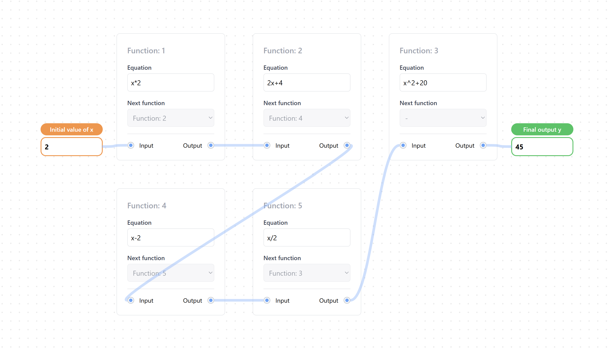

# Function Chain Calculator



This web application allows users to execute a chain of mathematical functions. Each function computes an output based on a user-defined equation, and the output is passed as the input to the next function. The application is designed to be easily extendable, allowing the addition of new functions and equations.

## Features

- **Interactive Function Cards**: Each function has its own card where users can define the mathematical equation.
- **Chain of Functions**: Each function passes its output to the next function, creating a sequence of computations.
- **Dynamic Updates**: When users modify an equation or the input value, the output is recalculated, and the changes are sent though every function.
- **Equation Validation**: Only basic arithmetic operations (addition, subtraction, multiplication, division, and exponents) are allowed in the equations.

## 📦 About Project

- React
- TypeScript
- Tailwind CSS
- Vite

### Project Structure

```
src/
   ├── components/
   │   ├── FunctionConnector.tsx
   │   ├── ValueComp.tsx
   │   └── FunctionCard.tsx
   ├── utils/
   │   ├── equationUtil.ts
   ├── hooks/
   │   ├── useFunction.ts
   ├── App.tsx
   ├── index.tsx
   └── ... (other source files)
```

## Setup

To get started with this project locally, follow the instructions below:

### 1. Clone the Repository

```bash
git clone https://github.com/pranavgoel29/function-chain-calculator.git
cd function-chain-calculator
```

### 2. Install Dependencies

Make sure you have **Node.js** installed. Then, run the following command to install all required dependencies:

```bash
pnpm install
```

### 3. Run the Development Server

Start the development server by running:

```bash
pnpm run dev
```

This will open the application in your browser.

### 4. Build the Project (Optional)

To build the project for production, run:

```bash
pnpm run build
```

This will create a `build` folder containing the optimized production build.

## How It Works

1. **Function Cards**:

   - Each function card displays an equation (e.g., `x^2 + 2`) and allows the user to modify it.
   - The user provides an initial value for `x` and can change it at any time.
   - When an equation is updated or a new input is provided, the output is recalculated using basic arithmetic operations.

2. **Function Chain**:

   - The output of one function is passed as the input to the next function in the sequence.
   - The chain can have multiple functions, and new functions can be added easily by modifying the `functions` array in the parent component (`App.tsx`).

3. **Mathematical Validation**:

   - The application only allows basic arithmetic operations (addition, subtraction, multiplication, division, and exponents).
   - The input is validated to ensure only these operations are used in the equations.

4. **Extensibility**:
   - New functions can be added simply by appending objects to the `functions` array in the parent component.
   - Each function object contains an `id`, an equation, the current input value, and the ID of the next function to which the output is passed.

## Future Enhancements

- **Function Addiotion**: We can add an option to add or remove more function and chain them.


## 🐛Bug Reporting

Feel free to [open an issue](https://github.com/pranavgoel29/functional-chaining) on GitHub if you find any bug.
